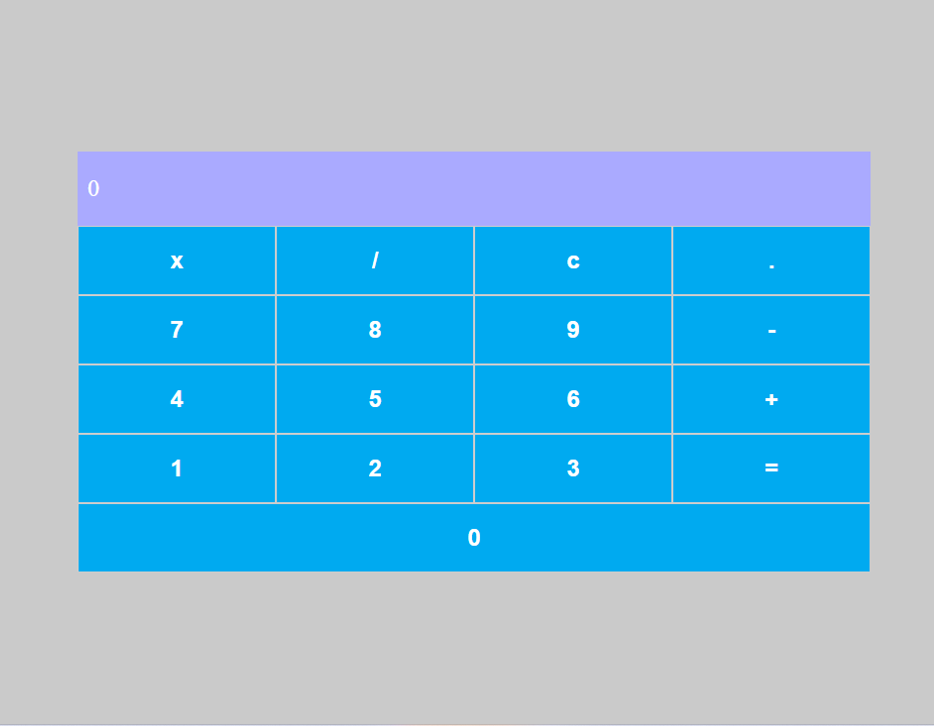

# Calculadora em React

Esta é uma aplicação de calculadora simples desenvolvida em React. A calculadora permite realizar operações básicas como soma, subtração, multiplicação e divisão, com uma interface intuitiva e fácil de usar.

## Pré-visualização



## Tecnologias Utilizadas

- **React + Vite**
- **Node.js**

## Instruções de Instalação

Siga os passos abaixo para clonar o repositório, instalar as dependências e rodar o aplicativo localmente:

### 1. Clone o Repositório

```
    git clone https://github.com/seu-usuario/app-calculadora.git
```

### 2. Acesse o Diretório da Aplicação

```
    cd app-calculadora
```

### 3. Instale as Dependências

**Obs.:** Certifique-se de que você tem o [Node.js](https://nodejs.org/pt/download/package-manager) acima da versão 18 instalada. Em seguida, execute o comando:

```
    npm install
```

### 4. Inicie a Aplicação

Após a instalação das dependências, inicie o servidor de desenvolvimento:

```
    npm run dev
```

A aplicação estará disponível em http://localhost:5173/.

### Funcionalidades

- Realizar operações de soma, subtração, multiplicação e divisão.
- Limpeza do visor da calculadora com o botão "C".